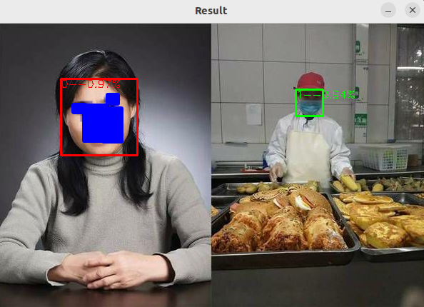

# **NWM**
 
> 主要应用领域：
> 明厨亮灶：不戴口罩检测

模型见： 
[百度网盘](https://pan.baidu.com/s/1YcG0zW1YbWbaiOq_lGNO7g?pwd=8dve)

提取码: 8dve 

## 构建编译

> **依赖**
> `OpenCV`: 图像处理相关， `linux` 下版本为 `opencv4.5.4`, `Windows` 使用的版本为 `opencv480`
> `ONNXRuntime`: 推理框架，适配性更广，可以支持 `CPU` 和 `GPU` ，目前使用版本为 `1.15.1`，后续可能升级，不过这不影响。
> `重大更新`: 将那些公共的部分单独抽离出来，方便后续升级，解耦仓库，之前出现过串库现象，调用 `NWM` 的库，调试跑到 `FSD` 库里去了。
> `nxu_utils`: 封装了内部一些常用的函数，后续可能会增加更多功能；在另外一个仓库，需要单独编译和安装。
> `nxu_det_ort`: 分为 GPU 版本和 CPU 版本，后续可能根据不同的模型进行升级；也是一个单独的库，需要单独编译和安装。

所有编译构建之前，请修改 cmake 文件夹下的 `find_depends.cmake` 依赖库的路径。

### `Linux(Ubuntu 22.04)`

一键编译， `bash onekey_linux_gpu_dynamic.sh`，支持 `GPU` 和 `CPU`，
